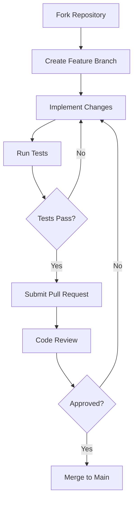

<p align="center">
  
</p>

<h1 align="center">Nexus Framework v2.6</h1>

<p align="center">
  <a href="https://github.com/Rick1330/Nexus-Framework/releases/tag/v2.6"></a>
  <a href="https://github.com/Rick1330/Nexus-Framework/tree/v2.6-development-plan"></a>
  <a href="https://github.com/Rick1330/Nexus-Framework/blob/v2.6-development-plan/LICENSE"></a>
  <a href="https://github.com/Rick1330/Nexus-Framework/tree/v2.6-development-plan/docs"></a>
</p>

<p align="center">
  <b>A world-class, distributed multi-agent engineering mega-system with specialized Manus accounts</b><br>
  Design, build, test, and deploy complex full-stack, AI, and DevOps projects through orchestrated specialized agents
</p>

<div align="center">
  <a href="#-quick-start">Quick Start</a> •
  <a href="#-key-features">Features</a> •
  <a href="#-documentation">Docs</a> •
  <a href="#-architecture">Architecture</a> •
  <a href="#-directory-guide">Directory Guide</a> •
  <a href="#-specialized-manus-accounts">Manus Accounts</a> •
  <a href="#-roadmap">Roadmap</a> •
  <a href="#-contributing">Contributing</a>
</div>

<hr>

## 🌟 Overview

Nexus Framework v2.6 represents a significant evolution in distributed multi-agent systems engineering, introducing specialized Manus accounts for domain-specific development, enhanced coordination mechanisms, and advanced development elements that maximize productivity and system quality.

Built on the architectural foundation of v2.4, this version introduces a comprehensive multi-phase development approach with specialized agent roles, toolchains, and integration logic designed for distributed yet coherent system development. The framework provides automated onboarding, advanced observability, continuous knowledge evolution, and robust resilience mechanisms to ensure development continuity despite disruptions.

<details>
<summary><b>🔍 Why Nexus Framework v2.6?</b></summary>
<br>

- **Distributed Development**: Specialized Manus accounts working in parallel with clear responsibilities
- **Enhanced Coordination**: Sophisticated communication protocols and integration mechanisms
- **Automated Onboarding**: Streamlined setup for each specialized account with personalized knowledge
- **Advanced Observability**: Comprehensive visibility across the distributed development process
- **Continuous Knowledge Evolution**: Automated knowledge capture, refinement, and distribution
- **Resilience Framework**: Robust mechanisms for development continuity despite disruptions
- **Automated Compliance**: Continuous verification of architectural principles and standards
- **Cross-Account Collaboration**: Specialized tools for efficient coordination and handoffs

</details>

## 🚀 Key Features

<table>
  <tr>
    <td width="33%">
      <h3>🧠 Specialized Manus Accounts</h3>
      <ul>
        <li>Domain-specific expertise and capabilities</li>
        <li>Clear responsibility boundaries</li>
        <li>Hierarchical coordination structure</li>
        <li>Balanced workload distribution</li>
      </ul>
    </td>
    <td width="33%">
      <h3>🔄 Multi-Phase Development</h3>
      <ul>
        <li>Six major development phases</li>
        <li>24 specialized sub-phases</li>
        <li>Parallel development streams</li>
        <li>Clear integration points</li>
      </ul>
    </td>
    <td width="33%">
      <h3>📊 Advanced Development Elements</h3>
      <ul>
        <li>Automated onboarding system</li>
        <li>Advanced observability framework</li>
        <li>Continuous knowledge evolution</li>
        <li>Resilience and recovery mechanisms</li>
      </ul>
    </td>
  </tr>
  <tr>
    <td>
      <h3>🔌 Coordination Logic</h3>
      <ul>
        <li>Structured communication channels</li>
        <li>Defined synchronization points</li>
        <li>Standardized artifact exchange</li>
        <li>Automated integration verification</li>
      </ul>
    </td>
    <td>
      <h3>💾 Knowledge Management</h3>
      <ul>
        <li>Specialized knowledge bases</li>
        <li>Automated knowledge extraction</li>
        <li>Knowledge refinement pipeline</li>
        <li>Personalized knowledge distribution</li>
      </ul>
    </td>
    <td>
      <h3>👥 Compliance & Governance</h3>
      <ul>
        <li>Continuous compliance verification</li>
        <li>Policy-as-code framework</li>
        <li>Governance automation</li>
        <li>Audit trail generation</li>
      </ul>
    </td>
  </tr>
</table>

## 🚦 Quick Start

```bash
# Clone the repository
git clone https://github.com/Rick1330/Nexus-Framework.git
cd Nexus-Framework

# Switch to the v2.6 development plan branch
git checkout v2.6-development-plan

# Review the development plan
cd docs/development/v2.6

# Initialize a specialized Manus account (when implementation is ready)
python src/onboarding/onboarding_manager.py Architect
```

### Prerequisites

- Python 3.9+
- Node.js 16+
- Docker and Docker Compose
- Git

<details>
<summary><b>⚙️ Advanced Setup Options</b></summary>
<br>

```bash
# Initialize multiple specialized Manus accounts
python scripts/initialize_accounts.py --accounts Architect,Backend,Frontend,DevOps

# Configure custom knowledge base
python scripts/configure_knowledge.py --account Architect --knowledge-dir /path/to/custom/knowledge

# Set up observability dashboard
python src/observability/setup_dashboard.py --port 3000
```

For detailed setup instructions, see the [Development Setup Guide](/docs/development/v2.6/setup.md).
</details>

## 📚 Documentation

Nexus Framework v2.6 includes comprehensive documentation organized into a clean, modular hierarchy:

<table>
  <tr>
    <td width="33%" valign="top">
      <h3>Development Plan</h3>
      <ul>
        <li><a href="/docs/development/v2.6/multi_phase_development_roadmap.md">Multi-Phase Development Roadmap</a></li>
        <li><a href="/docs/development/v2.6/manus_account_and_agent_role_assignments.md">Manus Account Assignments</a></li>
        <li><a href="/docs/development/v2.6/toolchain_and_environment_selection.md">Toolchain Selection</a></li>
        <li><a href="/docs/development/v2.6/coordination_and_integration_logic.md">Coordination Logic</a></li>
        <li><a href="/docs/development/v2.6/project_directory_structure.md">Project Structure</a></li>
        <li><a href="/docs/development/v2.6/testing_evaluation_and_security_strategy.md">Testing Strategy</a></li>
      </ul>
    </td>
    <td width="33%" valign="top">
      <h3>Enhanced Elements</h3>
      <ul>
        <li><a href="/docs/development/v2.6/enhanced_development_elements.md">Enhanced Development Elements</a></li>
        <li><a href="/docs/development/v2.6/manus_knowledge_and_github_guide.md">Manus Knowledge & GitHub Guide</a></li>
        <li><a href="/docs/development/v2.6/knowledge_base">Specialized Knowledge Base</a></li>
        <li><a href="/docs/development/v2.6/onboarding_guide.md">Onboarding Guide</a></li>
        <li><a href="/docs/development/v2.6/observability_guide.md">Observability Guide</a></li>
        <li><a href="/docs/development/v2.6/resilience_guide.md">Resilience Guide</a></li>
      </ul>
    </td>
    <td width="33%" valign="top">
      <h3>Implementation Resources</h3>
      <ul>
        <li><a href="/docs/development/v2.6/implementation_guide.md">Implementation Guide</a></li>
        <li><a href="/docs/development/v2.6/collaboration_protocols.md">Collaboration Protocols</a></li>
        <li><a href="/docs/development/v2.6/integration_points.md">Integration Points</a></li>
        <li><a href="/docs/development/v2.6/quality_gates.md">Quality Gates</a></li>
        <li><a href="/docs/development/v2.6/deployment_strategy.md">Deployment Strategy</a></li>
        <li><a href="/docs/development/v2.6/continuous_improvement.md">Continuous Improvement</a></li>
      </ul>
    </td>
  </tr>
</table>

## 🛠️ Architecture

<p align="center">
  
</p>

Nexus Framework v2.6 is built on a layered architecture that combines:

1. **Foundation Layer** - Core infrastructure, base framework, and development environment
2. **Orchestration Layer** - Workflow engine, task scheduler, message bus, and coordinators
3. **Agent Layer** - Agent framework, specialized agents, and collaboration protocols
4. **Cognitive Layer** - Memory system, knowledge base, reasoning engine, and learning system
5. **Integration Layer** - Tool integration, service connectors, data adapters, and external integrations
6. **Interface Layer** - API gateway, CLI, web interface, SDK, and documentation

This architecture ensures separation of concerns while enabling seamless communication between components, resulting in a system that is both robust and flexible.

## 📁 Directory Guide

The Nexus Framework v2.6 follows a structured directory organization for efficient development:

```
nexus-framework/
├── docs/                           # Documentation
│   ├── architecture/               # Architectural documentation
│   ├── core/                       # Core component documentation
│   └── development/                # Development documentation
│       └── v2.6/                   # v2.6 specific documentation
│           ├── knowledge_base/     # Specialized knowledge entries
│           │   ├── Manus-Architect/
│           │   ├── Manus-Backend/
│           │   └── ...
│           └── ...
├── src/                            # Source code
│   ├── agents/                     # Agent implementation
│   │   ├── base/                   # Base agent classes
│   │   └── specialized/            # Specialized agent implementations
│   ├── orchestration/              # Orchestration system
│   │   ├── workflow/               # Workflow engine
│   │   ├── scheduler/              # Task scheduler
│   │   ├── message_bus/            # Message bus
│   │   └── coordinator/            # Coordination components
│   ├── cognitive/                  # Cognitive system
│   │   ├── memory/                 # Memory system
│   │   ├── knowledge/              # Knowledge base
│   │   ├── reasoning/              # Reasoning engine
│   │   └── learning/               # Learning system
│   ├── integration/                # Integration components
│   │   ├── tools/                  # Tool integration
│   │   ├── services/               # Service connectors
│   │   ├── data/                   # Data adapters
│   │   └── external/               # External integrations
│   ├── interface/                  # Interface components
│   │   ├── api/                    # API gateway
│   │   ├── cli/                    # Command-line interface
│   │   ├── web/                    # Web interface
│   │   └── sdk/                    # Software development kit
│   ├── onboarding/                 # Onboarding automation
│   │   ├── config/                 # Account configurations
│   │   └── tutorials/              # Interactive tutorials
│   └── observability/              # Observability framework
│       ├── tracing/                # Distributed tracing
│       ├── metrics/                # Metrics collection
│       └── dashboards/             # Visualization dashboards
├── tests/                          # Test suite
│   ├── unit/                       # Unit tests
│   ├── integration/                # Integration tests
│   └── system/                     # System tests
├── workspaces/                     # Manus account workspaces
│   ├── manus-architect/            # Architect workspace
│   ├── manus-backend/              # Backend workspace
│   └── ...                         # Other account workspaces
└── scripts/                        # Utility scripts
    ├── setup.py                    # Setup script
    ├── initialize_accounts.py      # Account initialization
    └── ...                         # Other utility scripts
```

## 👤 Specialized Manus Accounts

Nexus Framework v2.6 utilizes eight specialized Manus accounts, each with specific roles and responsibilities:

<table>
  <tr>
    <th>Account</th>
    <th>Specialization</th>
    <th>Key Responsibilities</th>
  </tr>
  <tr>
    <td><b>Manus-Architect</b></td>
    <td>System architecture and technical decisions</td>
    <td>
      • High-level system design<br>
      • Architectural pattern implementation<br>
      • Technical decision frameworks<br>
      • Architecture validation
    </td>
  </tr>
  <tr>
    <td><b>Manus-Backend</b></td>
    <td>Backend systems, APIs, and data management</td>
    <td>
      • Server-side application development<br>
      • API design and implementation<br>
      • Database and data management<br>
      • Performance optimization
    </td>
  </tr>
  <tr>
    <td><b>Manus-Frontend</b></td>
    <td>User interfaces and client-side applications</td>
    <td>
      • UI/UX design and implementation<br>
      • Frontend framework expertise<br>
      • Responsive and accessible design<br>
      • Client-side performance optimization
    </td>
  </tr>
  <tr>
    <td><b>Manus-DevOps</b></td>
    <td>Infrastructure, deployment, and operations</td>
    <td>
      • Infrastructure as Code<br>
      • CI/CD pipeline development<br>
      • Container orchestration<br>
      • Monitoring and observability
    </td>
  </tr>
  <tr>
    <td><b>Manus-AI</b></td>
    <td>AI systems, machine learning, and cognitive computing</td>
    <td>
      • Machine learning model development<br>
      • Natural language processing<br>
      • Knowledge representation<br>
      • Reasoning systems
    </td>
  </tr>
  <tr>
    <td><b>Manus-QA</b></td>
    <td>Quality assurance, testing, and validation</td>
    <td>
      • Test strategy and planning<br>
      • Automated testing<br>
      • Performance testing<br>
      • Security testing
    </td>
  </tr>
  <tr>
    <td><b>Manus-Security</b></td>
    <td>Security architecture, implementation, and validation</td>
    <td>
      • Security architecture<br>
      • Threat modeling<br>
      • Secure coding practices<br>
      • Compliance and governance
    </td>
  </tr>
  <tr>
    <td><b>Manus-PM</b></td>
    <td>Project management, coordination, and communication</td>
    <td>
      • Project planning and tracking<br>
      • Resource allocation<br>
      • Risk management<br>
      • Cross-team coordination
    </td>
  </tr>
</table>

## 📈 Roadmap

<table>
  <tr>
    <th>Phase</th>
    <th>Timeline</th>
    <th>Focus</th>
  </tr>
  <tr>
    <td><b>Foundation</b></td>
    <td>Weeks 1-2</td>
    <td>
      • Core infrastructure setup<br>
      • Base framework implementation<br>
      • Development environment<br>
      • Automated onboarding system
    </td>
  </tr>
  <tr>
    <td><b>Orchestration Layer</b></td>
    <td>Weeks 3-4</td>
    <td>
      • Workflow engine<br>
      • Task scheduler<br>
      • Message bus<br>
      • Coordinators
    </td>
  </tr>
  <tr>
    <td><b>Agent Layer</b></td>
    <td>Weeks 5-6</td>
    <td>
      • Agent framework<br>
      • Specialized agents<br>
      • Collaboration protocols<br>
      • Knowledge evolution system
    </td>
  </tr>
  <tr>
    <td><b>Cognitive Layer</b></td>
    <td>Weeks 7-8</td>
    <td>
      • Memory system<br>
      • Knowledge base<br>
      • Reasoning engine<br>
      • Learning system
    </td>
  </tr>
  <tr>
    <td><b>Integration Layer</b></td>
    <td>Weeks 9-10</td>
    <td>
      • Tool integration<br>
      • Service connectors<br>
      • Data adapters<br>
      • External integrations
    </td>
  </tr>
  <tr>
    <td><b>Interface Layer</b></td>
    <td>Weeks 11-12</td>
    <td>
      • API gateway<br>
      • CLI<br>
      • Web interface<br>
      • SDK and documentation
    </td>
  </tr>
</table>

## 🤝 Contributing

We welcome contributions to the Nexus Framework! Please see our [Contribution Guidelines](/docs/development/contribution.md) for details on how to get involved.

### Development Workflow



## 👥 Contributors

<p align="center">
  <a href="https://github.com/Rick1330"></a>
  <!-- Add more contributors as the project grows -->
</p>

## 📄 License

Nexus Framework is released under the MIT License. See the [LICENSE](LICENSE) file for details.

## 👤 Author

Created and maintained by [Rick1330](https://github.com/Rick1330) (elishum8@gmail.com).

<hr>

<p align="center">
  <a href="/docs/index.md">Documentation</a> •
  <a href="https://github.com/Rick1330/Nexus-Framework/issues">Report Bug</a> •
  <a href="https://github.com/Rick1330/Nexus-Framework/issues">Request Feature</a>
</p>

<p align="center">
  © 2025 Rick (Elshaday Mengesha). All Rights Reserved.
</p>
