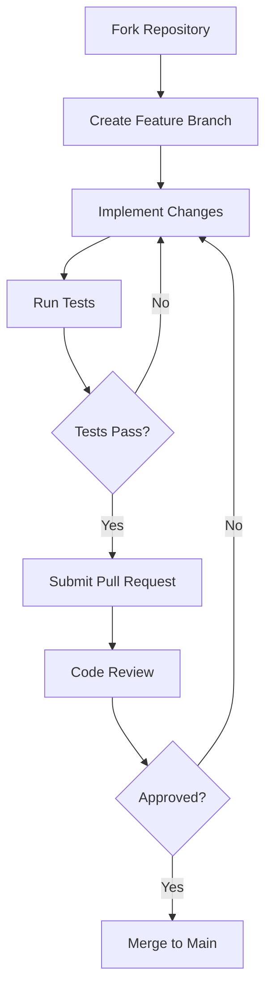

<p align="center">
  
</p>

<h1 align="center">Nexus Framework v2.3</h1>

<p align="center">
  <a href="https://github.com/Rick1330/Nexus-Framework/releases/tag/v2.3"></a>
  <a href="https://github.com/Rick1330/Nexus-Framework/tree/docs-restructure"></a>
  <a href="https://github.com/Rick1330/Nexus-Framework/blob/docs-restructure/LICENSE"></a>
  <a href="https://github.com/Rick1330/Nexus-Framework/tree/docs-restructure/docs"></a>
</p>

<p align="center">
  <b>A world-class, modular, scalable multi-agent engineering mega-system</b><br>
  Design, build, test, and deploy complex full-stack, AI, and DevOps projects through orchestrated agents
</p>

<div align="center">
  <a href="#-quick-start">Quick Start</a> •
  <a href="#-key-features">Features</a> •
  <a href="#-documentation">Docs</a> •
  <a href="#-architecture">Architecture</a> •
  <a href="#-roadmap">Roadmap</a> •
  <a href="#-contributing">Contributing</a>
</div>

<hr>

## 🌟 Overview

Nexus Framework v2.3 represents a significant evolution in multi-agent systems engineering, integrating cutting-edge open-source agent frameworks with sophisticated orchestration, memory management, and observability capabilities. Built to emulate the internal operations and coordination quality of elite engineering organizations like Google, OpenAI, and Anthropic, Nexus provides a comprehensive platform for developing complex, intelligent systems.

This framework is designed from the ground up with modularity, scalability, and production readiness at its core. With the v2.3 release, Nexus introduces native MetaGPT integration, advanced testing frameworks, resilient architecture patterns, and human-in-the-loop coordination systems that set new standards for multi-agent engineering.

<details>
<summary><b>🔍 Why Nexus Framework?</b></summary>
<br>

- **Production-Grade Architecture**: Built for real-world deployment with comprehensive operational readiness
- **Modular Design**: Plug-and-play components with clean interfaces for maximum flexibility
- **Open Source Integration**: Seamless integration with best-in-class open source tools and frameworks
- **Enterprise-Ready**: Security, observability, and governance built into the core architecture
- **Developer-Friendly**: Comprehensive documentation and intuitive developer experience
- **Future-Proof**: Designed to evolve with the rapidly changing AI and engineering landscape

</details>

## 🚀 Key Features

<table>
  <tr>
    <td width="33%">
      <h3>🧠 Advanced Agent Architecture</h3>
      <ul>
        <li>Hierarchical agent organization</li>
        <li>Specialized domain experts</li>
        <li>Native MetaGPT integration</li>
        <li>Capability-based specialization</li>
      </ul>
    </td>
    <td width="33%">
      <h3>🔄 Robust Orchestration</h3>
      <ul>
        <li>Sophisticated workflow engine</li>
        <li>Failure recovery mechanisms</li>
        <li>State preservation across cycles</li>
        <li>Dynamic resource allocation</li>
      </ul>
    </td>
    <td width="33%">
      <h3>📊 Enterprise Integration</h3>
      <ul>
        <li>Comprehensive observability</li>
        <li>Security at every layer</li>
        <li>GitHub-first workflows</li>
        <li>Deployment automation</li>
      </ul>
    </td>
  </tr>
  <tr>
    <td>
      <h3>🔌 Tool Ecosystem</h3>
      <ul>
        <li>External tool registry</li>
        <li>API gateway integration</li>
        <li>Plugin architecture</li>
        <li>Custom tool development</li>
      </ul>
    </td>
    <td>
      <h3>💾 Advanced Memory</h3>
      <ul>
        <li>Multi-tier memory system</li>
        <li>Vector-based retrieval</li>
        <li>Knowledge graph integration</li>
        <li>Context-aware persistence</li>
      </ul>
    </td>
    <td>
      <h3>👥 Human Collaboration</h3>
      <ul>
        <li>Intervention point architecture</li>
        <li>Expert routing system</li>
        <li>Feedback integration</li>
        <li>Workflow transition management</li>
      </ul>
    </td>
  </tr>
</table>

## 🚦 Quick Start

```bash
# Clone the repository
git clone https://github.com/Rick1330/Nexus-Framework.git
cd Nexus-Framework

# Switch to the documentation branch
git checkout docs-restructure

# Install dependencies
pip install -e .

# Run the setup script
python scripts/setup.py

# Start the development server
python scripts/dev_server.py
```

### Prerequisites

- Python 3.9+
- Node.js 16+
- Docker and Docker Compose
- Git

<details>
<summary><b>⚙️ Advanced Setup Options</b></summary>
<br>

```bash
# Development setup with all optional dependencies
pip install -e ".[dev,test,docs]"

# Configure environment variables
cp .env.example .env
# Edit .env with your settings

# Run with custom configuration
python scripts/dev_server.py --config=custom_config.yaml
```

For detailed setup instructions, see the [Local Development Setup Guide](/docs/development/setup.md).
</details>

## 📚 Documentation

Nexus Framework v2.3 includes comprehensive documentation organized into a clean, modular hierarchy:

<table>
  <tr>
    <td width="33%" valign="top">
      <h3>Core Documentation</h3>
      <ul>
        <li><a href="/docs/architecture/overview.md">Architecture Overview</a></li>
        <li><a href="/docs/architecture/technical_blueprint.md">Technical Blueprint</a></li>
        <li><a href="/docs/architecture/agent_layers.md">Agent Layers</a></li>
        <li><a href="/docs/core/agents/index.md">Agent Framework</a></li>
        <li><a href="/docs/core/orchestration/workflow_engine.md">Orchestration</a></li>
        <li><a href="/docs/core/memory/knowledge_graph.md">Memory System</a></li>
      </ul>
    </td>
    <td width="33%" valign="top">
      <h3>Implementation Guides</h3>
      <ul>
        <li><a href="/docs/documentation_upgrade/testing_framework_for_agent_systems.md">Testing Framework</a></li>
        <li><a href="/docs/documentation_upgrade/resilience_and_failure_recovery_architecture.md">Resilience & Recovery</a></li>
        <li><a href="/docs/documentation_upgrade/security_model_and_sandboxing.md">Security Model</a></li>
        <li><a href="/docs/documentation_upgrade/resource_management_architecture.md">Resource Management</a></li>
        <li><a href="/docs/documentation_upgrade/agent_specialization_framework.md">Agent Specialization</a></li>
        <li><a href="/docs/documentation_upgrade/knowledge_management_pipelines.md">Knowledge Management</a></li>
      </ul>
    </td>
    <td width="33%" valign="top">
      <h3>Developer Resources</h3>
      <ul>
        <li><a href="/docs/development/onboarding.md">Developer Onboarding</a></li>
        <li><a href="/docs/development/setup.md">Local Development Setup</a></li>
        <li><a href="/docs/development/style_guide.md">Style Guide</a></li>
        <li><a href="/docs/development/testing.md">Testing Guidelines</a></li>
        <li><a href="/docs/development/contribution.md">Contribution Guidelines</a></li>
        <li><a href="/docs/tutorials/quickstart.md">Quickstart Tutorial</a></li>
      </ul>
    </td>
  </tr>
</table>

<details>
<summary><b>📖 Full Documentation Map</b></summary>
<br>

### System Architecture
- [Architecture Overview](/docs/architecture/overview.md)
- [Technical Blueprint](/docs/architecture/technical_blueprint.md)
- [Agent Layers](/docs/architecture/agent_layers.md)
- [Modular Multi-Agent Architecture](/docs/architecture/modular_multi_agent_architecture.md)
- [Multi-Domain Engineering](/docs/architecture/multi_domain_engineering.md)

### Core Components
- [Agents Framework](/docs/core/agents/index.md)
  - [Agent Specialization](/docs/core/agents/specialization.md)
  - [Agent Roles](/docs/core/agents/roles.md)
  - [Agent Roles and Protocols](/docs/core/agents/agent_roles_and_protocols.md)
- [Orchestration](/docs/core/orchestration/workflow_engine.md)
  - [Workflow Engine](/docs/core/orchestration/workflow_engine.md)
  - [Task Scheduling](/docs/core/orchestration/task_scheduling.md)
  - [Failure Recovery](/docs/core/orchestration/failure_recovery.md)
  - [Orchestration and Fallback](/docs/core/orchestration/orchestration_and_fallback.md)
- [Memory System](/docs/core/memory/knowledge_graph.md)

### Operations
- [Deployment](/docs/operations/deployment/index.md)
- [Security](/docs/operations/security/index.md)
- [Resource Management](/docs/operations/resource_management/index.md)

### Integrations
- [GitHub Integration](/docs/integrations/github.md)
- [GitHub Integration and CI/CD](/docs/integrations/github_integration_and_cicd.md)
- [External Tool Integration](/docs/integrations/external_tool_integration.md)
- [Open Source Integration Map](/docs/integrations/open_source_integration_map.md)

### Critical Implementation Guides
- [Testing Framework for Agent Systems](/docs/documentation_upgrade/testing_framework_for_agent_systems.md)
- [Resilience and Failure Recovery](/docs/documentation_upgrade/resilience_and_failure_recovery_architecture.md)
- [Security Model and Sandboxing](/docs/documentation_upgrade/security_model_and_sandboxing.md)
- [Resource Management Architecture](/docs/documentation_upgrade/resource_management_architecture.md)
- [Agent Specialization Framework](/docs/documentation_upgrade/agent_specialization_framework.md)
- [Knowledge Management Pipelines](/docs/documentation_upgrade/knowledge_management_pipelines.md)
- [Human-in-the-Loop Coordination](/docs/documentation_upgrade/human_in_the_loop_coordination.md)
- [Operational Readiness & Deployment](/docs/documentation_upgrade/operational_readiness_and_deployment.md)

</details>

## 🛠️ Architecture

<p align="center">
  
</p>

Nexus Framework v2.3 is built on a layered architecture that combines:

1. **Core Layer** - Fundamental components including orchestration, memory, and security
2. **Agent Layer** - Specialized agents with domain-specific capabilities
3. **Integration Layer** - Connections to external tools, APIs, and services
4. **Interface Layer** - Human interaction points and developer tools

This architecture ensures separation of concerns while enabling seamless communication between components, resulting in a system that is both robust and flexible.

## 📈 Roadmap

<table>
  <tr>
    <th>Phase</th>
    <th>Timeline</th>
    <th>Focus</th>
  </tr>
  <tr>
    <td><b>Foundation</b><br>(Current)</td>
    <td>Q2 2025</td>
    <td>
      • Core architecture implementation<br>
      • Testing framework development<br>
      • Security model implementation<br>
      • Basic agent specialization
    </td>
  </tr>
  <tr>
    <td><b>Expansion</b></td>
    <td>Q3 2025</td>
    <td>
      • Advanced agent capabilities<br>
      • Knowledge management system<br>
      • Human-in-the-loop coordination<br>
      • Operational readiness features
    </td>
  </tr>
  <tr>
    <td><b>Integration</b></td>
    <td>Q4 2025</td>
    <td>
      • External tool ecosystem<br>
      • Enterprise deployment patterns<br>
      • Advanced observability<br>
      • Performance optimization
    </td>
  </tr>
  <tr>
    <td><b>Maturity</b></td>
    <td>Q1 2026</td>
    <td>
      • Community plugin system<br>
      • Advanced learning capabilities<br>
      • Multi-modal agent support<br>
      • Enterprise governance features
    </td>
  </tr>
</table>

## 🤝 Contributing

We welcome contributions to the Nexus Framework! Please see our [Contribution Guidelines](/docs/development/contribution.md) for details on how to get involved.

### Development Workflow



## 👥 Contributors

<p align="center">
  <a href="https://github.com/Rick1330"></a>
  <!-- Add more contributors as the project grows -->
</p>

## 📄 License

Nexus Framework is released under the MIT License. See the [LICENSE](LICENSE) file for details.

## 👤 Author

Created and maintained by [Rick1330](https://github.com/Rick1330) (elishum8@gmail.com).

<hr>

<p align="center">
  <a href="/docs/index.md">Documentation</a> •
  <a href="https://github.com/Rick1330/Nexus-Framework/issues">Report Bug</a> •
  <a href="https://github.com/Rick1330/Nexus-Framework/issues">Request Feature</a>
</p>

<p align="center">
  © 2025 Rick (Elshaday Mengesha). All Rights Reserved.
</p>
